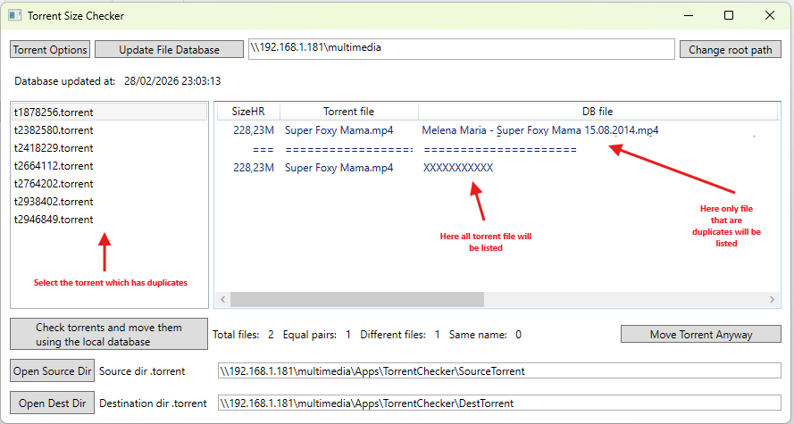

# Torrent Size Checker

> A WPF desktop tool for Windows that checks whether the files described inside `.torrent` files already exist on your hard drive — by comparing file sizes against a pre-built local database.

---

## 📥 Download

<!-- PLACEHOLDER: add release link here -->
> ⬇️ **[Download latest release](https://github.com/gianalbertochini/TorrentSizeCheckerWPF/releases/latest)**

---

## 📸 Screenshots

<!-- PLACEHOLDER: replace with actual screenshots -->
| Main window | Column visibility menu |
|---|---|
|  |  |

---

## 📖 Description

### Brief introduction

Torrent Size Checker solves a common problem for users who manage large media libraries: **you download a `.torrent` file but you are not sure whether you already have those files on disk**. Instead of opening a torrent client and waiting for it to hash-check everything, this tool does a fast size-based pre-check in seconds.

### How it works

The tool works in two phases:

1. **Build the database** — you point the tool at a root folder on your drive (e.g. a NAS share or a local media folder). It scans all files recursively and saves the path and size of every file larger than 500 KB into a local `database.txt` file.

2. **Check torrents** — you point the tool at a folder containing `.torrent` files. For each torrent, it reads the list of files described inside it and compares their sizes against the database. If every file in a torrent already has a size-matching entry in the database, the torrent is considered **already downloaded** and is moved to a "checked" destination folder. Torrents that contain at least one file not found in the database are kept in the source folder and displayed in the main list for manual review.

### Key features

- ✅ Fast scan — no hashing, pure size comparison
- ✅ Supports single-file and multi-file torrents
- ✅ Fluid, resizable UI (works on any screen resolution)
- ✅ Results table with configurable columns (right-click on column headers to show/hide)
- ✅ Human-readable file sizes (KB, MB, GB, TB with 2 decimal places)
- ✅ Database stores root path, source path, destination path and update timestamp
- ✅ Visual indicator when paths have been modified but not saved (red highlight)

---

## 🛠️ Requirements

- Windows 10 / 11
- [.NET 10 Desktop Runtime](https://dotnet.microsoft.com/en-us/download/dotnet/10.0)

---

## 🚀 How to use

### Step 1 — Set the root path and build the database

1. Launch `TorrentSizeCheckerWPF.exe`.
2. In the **top text box**, type (or click **Change root path** to browse to) the root folder of your media library.  
   Example: `\\myserver\Media\` or `D:\Movies\`
3. Click **Update File Database**.  
   A confirmation dialog will appear — click **Yes**.  
   The tool will scan all files recursively and save the results to `database.txt` in the application folder.  
   ⚠️ This step can take several minutes for large libraries. Run it only when your library changes significantly.
4. When the scan is complete, the top bar will show the database update timestamp.

> **Note:** The database only indexes files larger than **500 KB** to avoid polluting results with thumbnails and metadata files.

---

### Step 2 — Set source and destination directories

At the bottom of the window:

| Field | Description |
|---|---|
| **Source dir .torrent** | Folder where your `.torrent` files to check are located |
| **Destination dir .torrent** | Folder where torrents that are already downloaded will be moved |

Click **Open Source Dir** / **Open Dest Dir** to browse, or type the paths directly.  
The text box turns **red** when the path has been modified but not yet saved to the database.

---

### Step 3 — Check torrents and move them

Click **Check torrents and move them using the local database**.

The tool will:
- Parse every `.torrent` file in the source directory.
- Compare each file listed in the torrent against the database by size.
- **Move** torrents where all files are found in the database → to the destination directory.
- **Keep** torrents where at least one file is missing → in the source directory (shown in the left list).

---

### Step 4 — Review the results

The left panel (**torrent list**) shows all torrents that were **not** automatically moved because at least one file was not found.

Click on a torrent name to see the details in the main table on the right:

| Column | Description |
|---|---|
| **SizeHR** | File size in human-readable format (e.g. `1.45G`) |
| **Torrent file** | Name of the file as listed inside the torrent |
| **DB file** | Name of the matching file found in the database |
| **DB full path** | Full path of the matching file on disk |

The table is divided in two sections by a separator row:
- **Top section** — files from the torrent that **were found** in the database (duplicates)
- **Bottom section** — files from the torrent that were **not found** in the database (unique / missing)

The counters at the bottom show:
- **Total files** — total number of files in the selected torrent
- **Equal pairs** — files found in the database
- **Different files** — files not found in the database
- **Same name** — pairs where both the torrent file name and the database file name are identical

---

### Step 5 — Move a torrent manually

If you have reviewed a torrent and want to move it to the destination folder regardless of the check result, select it in the left list and click **Move Torrent Anyway**.

---

## ⚙️ Database file format

The `database.txt` file is a plain text file with the following structure:

```
<root directory path>
<last update timestamp>
<torrent source directory>
<torrent destination directory>
<file path 1>
<file size in bytes 1>
<file path 2>
<file size in bytes 2>
...
```

You can open and edit it manually if needed. If the file is missing or corrupt, the tool will notify you on startup.

---

## 🏗️ Build from source

```bash
git clone https://github.com/gianalbertochini/TorrentSizeCheckerWPF.git
cd TorrentSizeCheckerWPF
dotnet build
```

Requirements: [.NET 10 SDK](https://dotnet.microsoft.com/en-us/download/dotnet/10.0) + Windows

---

## 📦 Dependencies

- [BencodeNET](https://github.com/Krusen/BencodeNET) — for parsing `.torrent` files (bencode format)

---

## 📄 License

<!-- PLACEHOLDER: add license -->
This project is licensed under the [MIT License](LICENSE).
